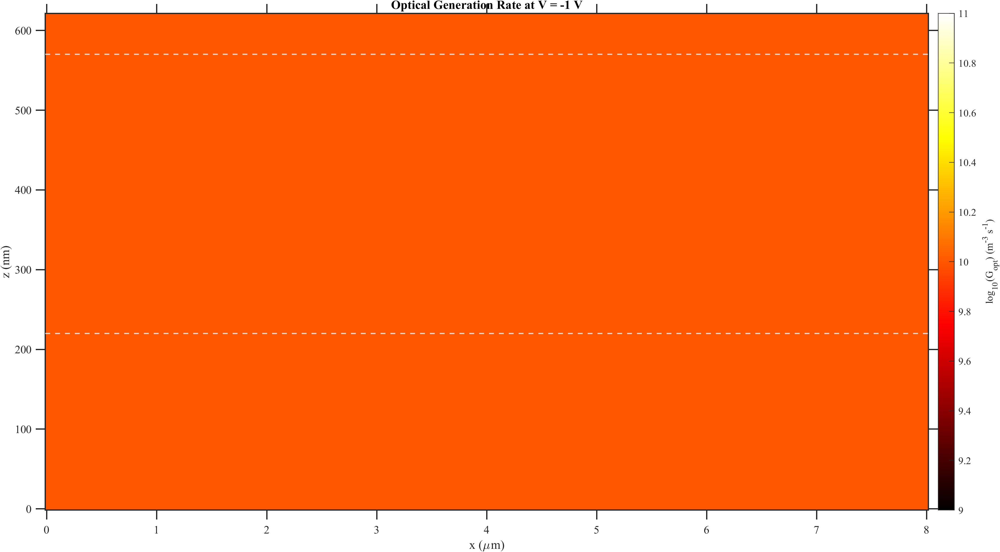
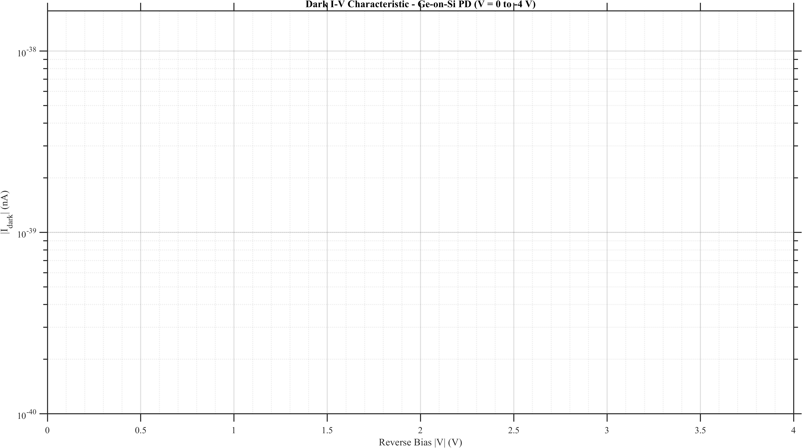
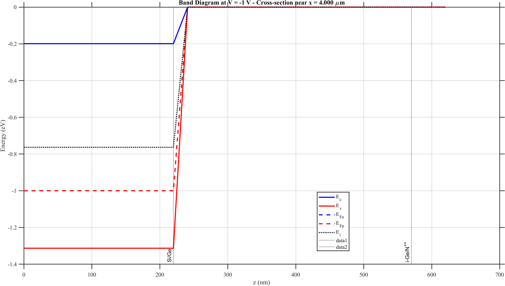
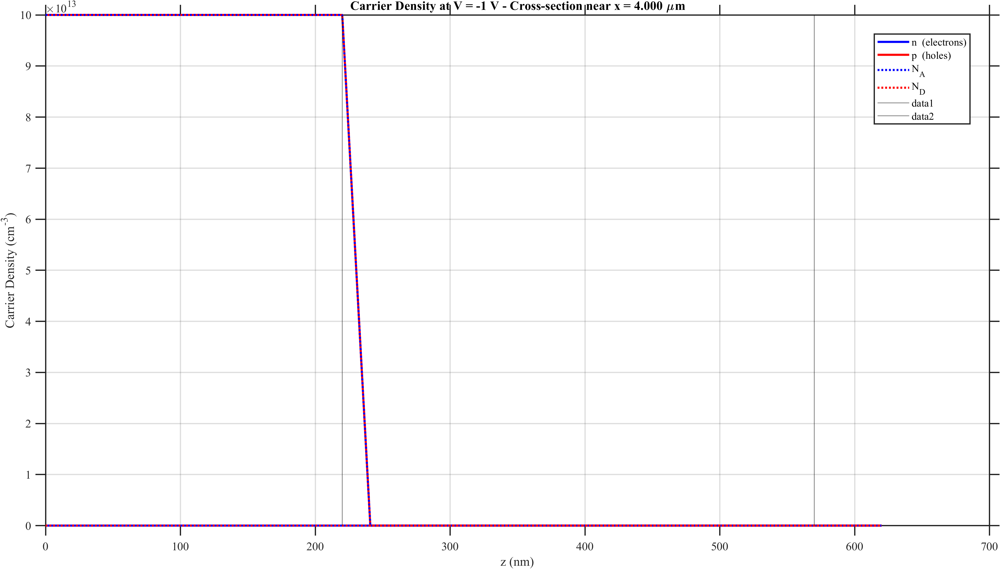
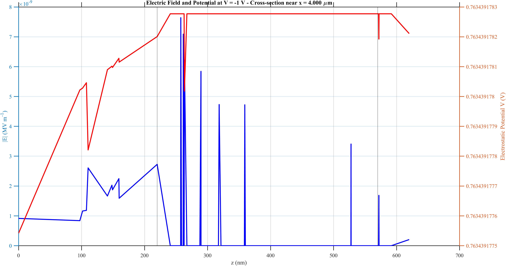
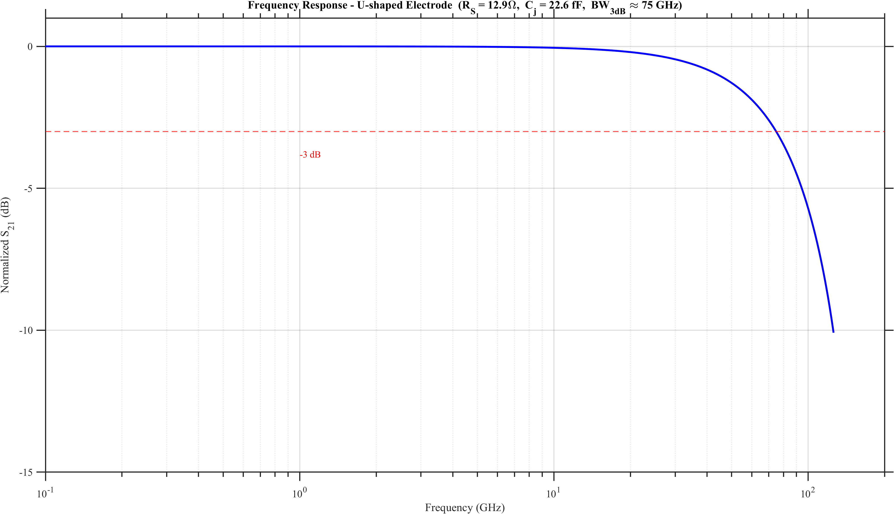
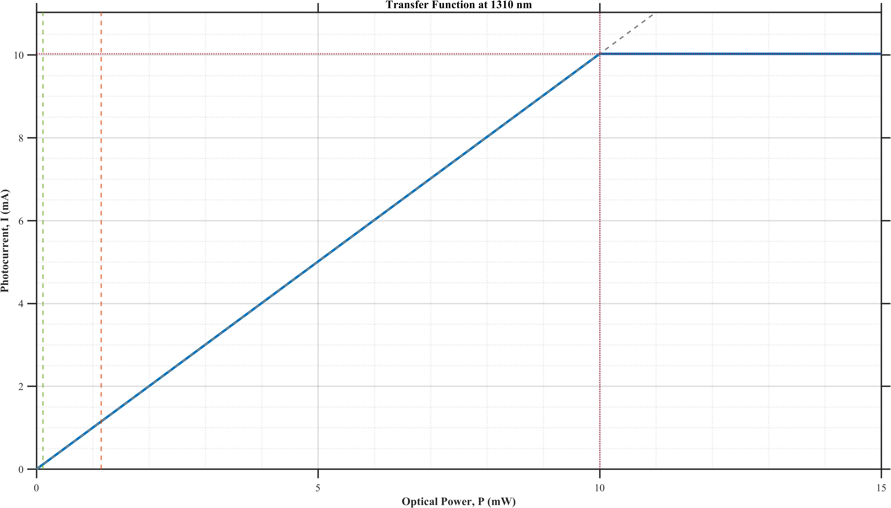
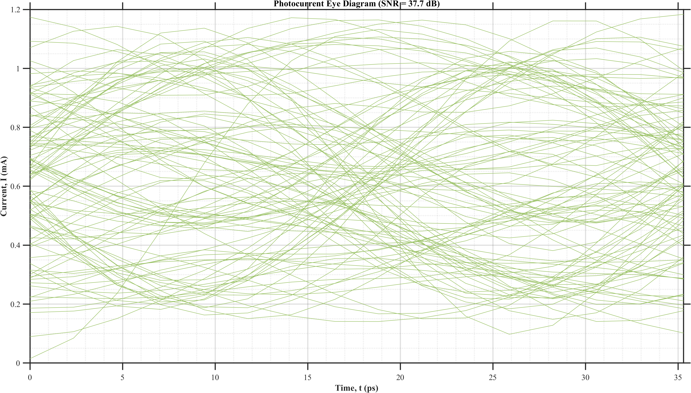
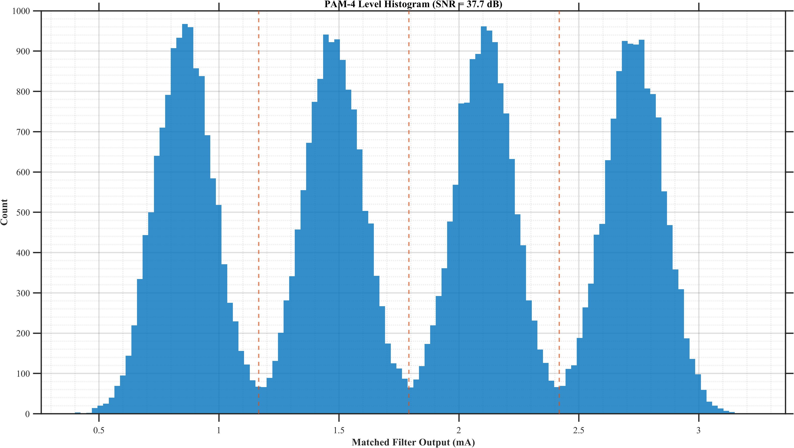
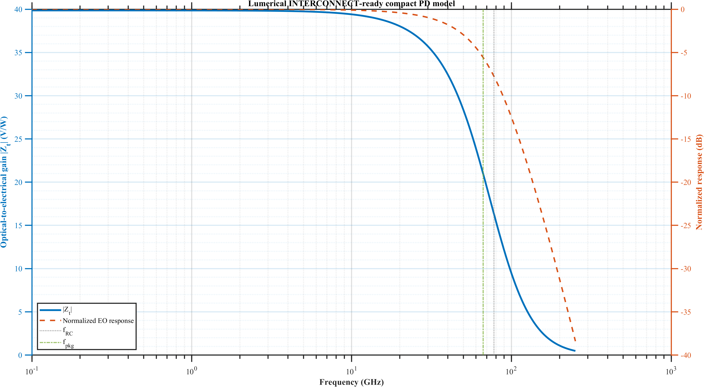

<!-- _class: lead -->
<!-- _header: PD-Design-Kit -->
<!-- _footer: Companion presentation for thesis/chapter_photodetector.tex -->

# Ge-on-Si Photodetector Design and Simulation
### O-band vertical n-i-p photodiode for high-speed PAM-4 optical receivers

**Islam I. Abdulaal**  
Electronics and Communications Engineering, Alexandria University, 2026

<div class="muted">
Companion Marp deck for the thesis chapter and repo figures.
</div>

---

## Motivation and Targets

- Intra-datacenter PAM-4 receivers need **high responsivity**, **very low dark current**, and **bandwidth above 100 GHz**.
- A **Ge-on-Si vertical n-i-p photodiode** offers a strong fit with standard SOI photonics.
- The chapter benchmarks the design against Yang Shi et al., *Photonics Research* 12(1), 2024.

| Metric | Target |
|---|---:|
| Responsivity | **>= 0.95 A/W** |
| Dark current | **<= 1.3 nA** |
| Bandwidth | **>= 103 GHz** |
| Detectivity | **>= 2.95 x 10^10 cm sqrt(Hz) / W** |

---

## Device Architecture

<div class="cols-60-40">
<div>

- Vertical **n-i-p** stack on a **220 nm SOI** platform.
- **50 nm n++ Ge** top contact layer.
- **350 nm intrinsic Ge** absorber.
- **p++ Si** platform for the anode path.
- **U-shaped electrode** reduces the RC penalty while preserving carrier collection.

<div class="card">
Strong optical absorption comes from the Ge layer, while the electrical design is tuned to protect the 3 dB bandwidth.
</div>

</div>
<div>

| Layer | Thickness |
|---|---:|
| n++ Ge | 50 nm |
| i-Ge | 350 nm |
| p++ Si | 220 nm |
| BOX | 2 um |

</div>
</div>

---

## Optical Simulation Flow

- **Lumerical FDTD** models the taper-coupled optical absorption at **1310 nm**.
- The simulation exports **optical generation rate** into CHARGE.
- Ge length is optimized to reach high absorption with minimum footprint.

<div class="cols">
<div>

### Key optical design points

- TE-driven O-band operation
- Adiabatic spot-size converter (500 nm → 5 µm over 40 µm)
- 3D generation-rate export: G = P_abs / (hf)

</div>
<div>



</div>
</div>

---

## Electrical Simulation Flow

- **Lumerical DEVICE CHARGE** solves carrier transport under reverse bias.
- SRH recombination enabled with **τ_n = τ_p = 5 ns** (calibrated to match 1.3 nA).
- Fine mesh override: **20 nm** max edge length over the Ge active region.
- Extracted quantities include:
  - dark current and illuminated current
  - band diagram, carrier density
  - electric field and potential
- Bandwidth estimated from **transit-time + RC** limits.

---

## Dark Current Result

<div class="cols">
<div>

- The design target at **-1 V** is **1.3 nA**.
- Low dark current is essential for:
  - receiver sensitivity
  - noise performance
  - robust PAM-4 eye opening

<div class="card">
The SRH lifetime (τ = 5 ns) was calibrated against published dark current data to anchor the electrical simulation.
</div>

</div>
<div>



</div>
</div>

---

## Internal Device Physics

<div class="cols">
<div>



</div>
<div>



</div>
</div>

<div class="muted">
Band alignment, carrier density, and depletion shaping near -1 V explain the tradeoff between responsivity, dark current, and speed.
</div>

---

## Electric Field and Bandwidth

<div class="cols">
<div>



</div>
<div>



</div>
</div>

- Transit-time and RC contributions are combined into the chapter bandwidth estimate.
- The calibrated design reaches the **100+ GHz** performance class targeted by the reference work.

---

## System-Level Receiver View

- The repo extends the device into a **MATLAB PAM-4 receiver model** at **53.125 GBd**.
- Exported figures are thesis-ready and share a unified style.

<div class="cols">
<div>



</div>
<div>



</div>
</div>

---

## PAM-4 Signal Quality

<div class="cols">
<div>



</div>
<div>

- Matched-filter output shows **4 distinct PAM-4 levels**.
- Decision thresholds (red dashed) separate the symbol clusters.
- SNR, BER, and SER are computed from the simulation.
- The PD can now be studied both as a device and as a circuit block.

</div>
</div>

---

## INTERCONNECT-Ready Compact Model

- The repo also exports a **Lumerical INTERCONNECT-ready** photodetector data package.
- Generated artifacts include:
  - responsivity table (frequency-dependent)
  - bandwidth table (bias-dependent)
  - dark-current table
  - compact-model `.mat` source data
  - equivalent-circuit parameters CSV



---

## Data Pipeline Overview

```text
ge_pd_fdtd_oband.lsf  ──►  ge_gen_oband.mat  ──►  ge_pd_device_oband.lsf
        │                                                    │
        ▼                                                    ▼
fdtd_summary_oband.mat              ge_charge_results_oband.mat
        │                                                    │
        └────────────────►  ge_pd_oband_postprocess.m  ◄─────┘
                                     │
                                     ▼
                            thesis/figures/*.pdf
```

<div class="card">
All parameters flow from Lumerical → MAT files → MATLAB postprocess → thesis figures. Nothing is hardcoded in the pipeline.
</div>

---

## Final Takeaways

- The chapter demonstrates a **Ge-on-Si O-band photodiode** that aligns with published high-speed targets.
- The workflow is consistent across:
  - **device-level FDTD** (optical absorption, generation rate)
  - **device-level CHARGE** (dark current, responsivity, band structure)
  - **system-level MATLAB** (PAM-4 BER, eye diagrams, histograms)
  - **INTERCONNECT-ready export** (circuit-level integration)
- The thesis chapter, figures, and this Marp presentation live together inside the same repo.

<div class="muted">
Source deck: <code>thesis/chapter_photodetector_slides.md</code> · Version 1.2.0
</div>
